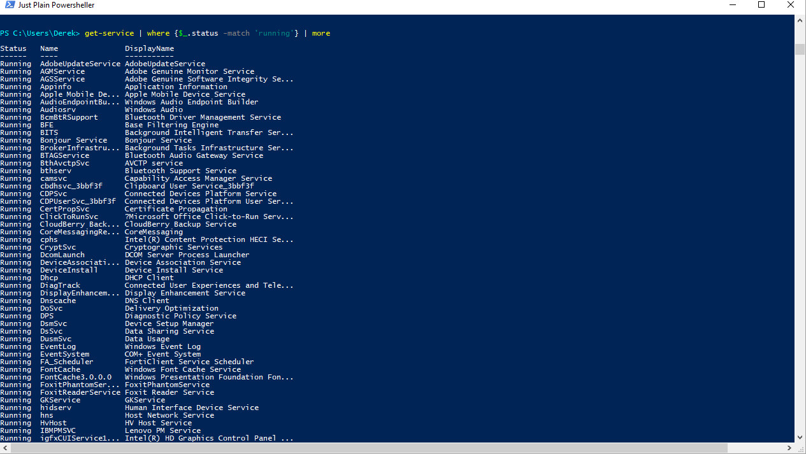

# Lab Help Find the Spooler Service and Running Services

## SYNOPSIS
Collect information about a single service or the services with a specified status

## DESCRIPTION
Using PowerShell, display the Spooler Service on your system.  Then display all of the services with a status of Running

## EXAMPLES

### EXAMPLE 1
Get the Print Spooler Service `get-service | where {$_.name -match "spooler"}`

### EXAMPLE 2
List the services with a running status `get-service | where {$_.status -eq 'Running'}` 

 

## NOTES
Please use the examplea as needed to work through the Labs. Some of the examples in the earlier labs may directly provide the solution
you are looking for - as we progress this may not be the case and you may need to work with others around you or build on what has been
presented in previous sessions to work through the labs.

While you may find some results in Google that will get you the answer you seek - please try not to jump right to the Internet to collect
the answers to the labs - working out the problem with the tools mentioned in the session and previous lab documents and working with 
colleagues will also help you work through the labs. 

