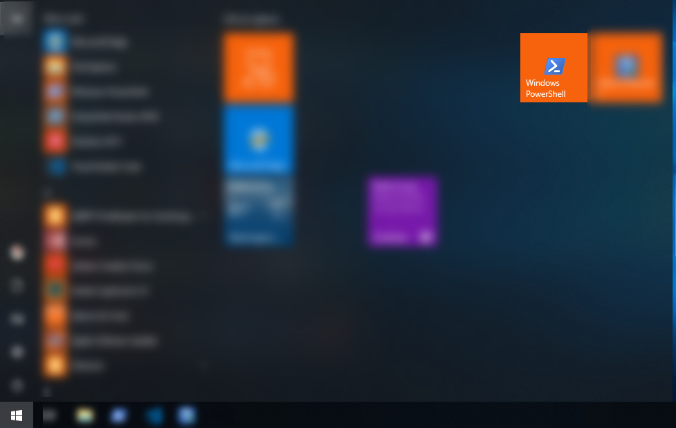
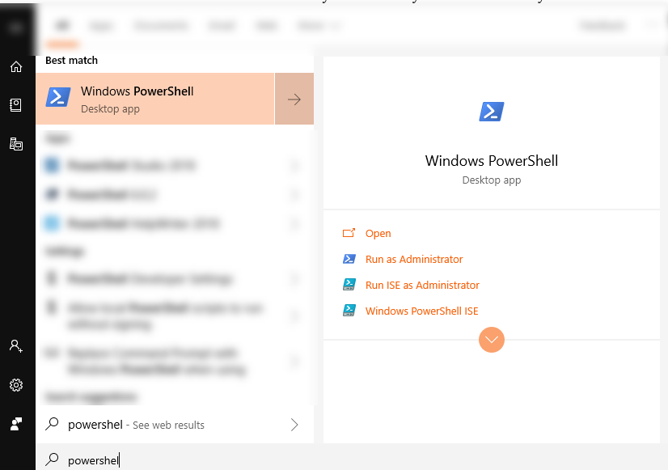
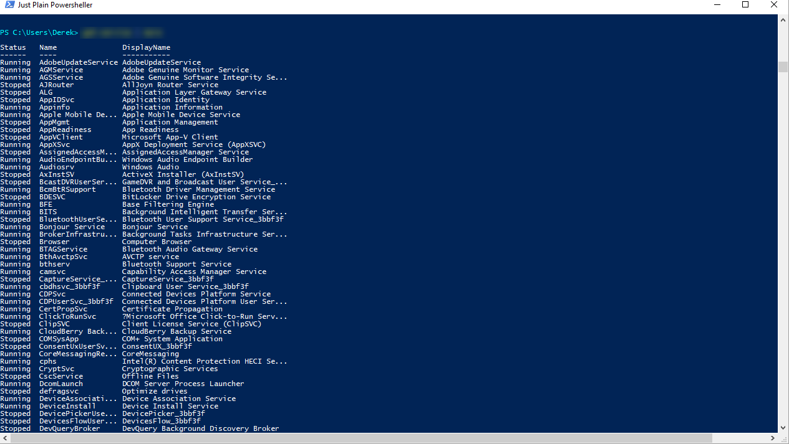
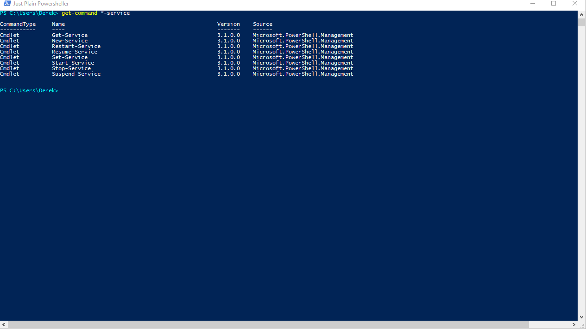

# Lab Help Start PowerShell and and Return System Services

## SYNOPSIS
Start the PowerShell console on your system and return the installed services

## DESCRIPTION
In the PowerShell console - display a list of the installed services on your system

## EXAMPLES

### EXAMPLE 1
Select the Start Button and Open PowerShell

### EXAMPLE 2
Select the Start Button and type PowerShell

 

### EXAMPLE 3
List the System Services in the PowerShell console

Run get-service in the PowerShell console
`get-service`

### EXAMPLE 4
Find the cmdlet that will return the cmdlets for services

Use get-command to look up cmdlets related to services
`get-command *-service`

## NOTES
Please use the examplea as needed to work through the Labs. Some of the examples in the earlier labs may directly provide the solution
you are looking for - as we progress this may not be the case and you may need to work with others around you or build on what has been
presented in previous sessions to work through the labs.

While you may find some results in Google that will get you the answer you seek - please try not to jump right to the Internet to collect
the answers to the labs - working out the problem with the tools mentioned in the session and previous lab documents and working with 
colleagues will also help you work through the labs. 

